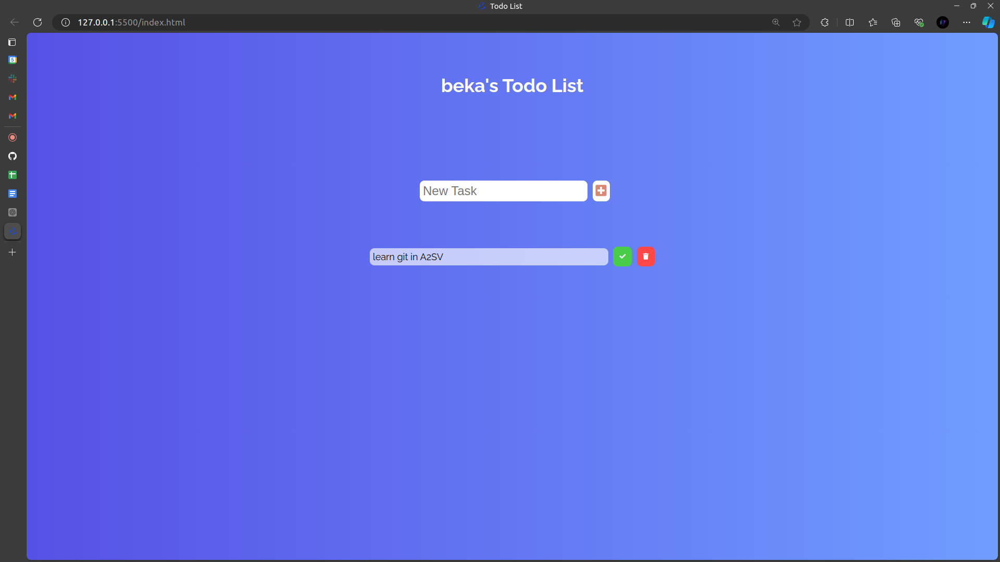

# Todo List Application

This is a simple Todo List application built with HTML, CSS, and JavaScript. It allows users to add, delete, and mark todos as complete. This version of the application uses an in-memory implementation to manage the todos.

## Features

- Add a new todo
- Delete a todo
- Mark a todo as complete/incomplete

## Getting Started

Visit [Todo List Application](https://beka-birhanu.github.io/todo-list/) in your web browser to start the application.

## Screenshot

## Usage

1. **Adding a Todo:**

   - Enter the todo text in the input field.
   - Click the "Add" button to add the todo to the list.

2. **Deleting a Todo:**

   - Click the trash icon next to the todo you want to delete.

3. **Marking a Todo as Complete:**

   - Click the check icon next to the todo to mark it as complete.
   - Click the check icon again to mark it as incomplete.

## Code Overview

### HTML

The HTML file contains the structure of the Todo List application, including the input field, add button, and the list where todos are displayed.

### CSS

The CSS file contains the styles for the Todo List application, including layout, colors, and transitions.

### JavaScript

The JavaScript file contains the logic for managing the todos. The main functions include:

- `getTodosFromMemory()`: Loads todos from the in-memory storage when the page is loaded.
- `addTodo()`: Adds a new todo to the list.
- `deleteCheck()`: Deletes a todo or marks it as complete/incomplete based on the button clicked.
- `saveTodoToMemory(todo)`: Saves a new todo to the in-memory storage.
- `createTodoElement(todoText, completed)`: Creates a new todo element.

## License

This project is licensed under the MIT License. See the [LICENSE](LICENSE) file for details.

## Contributing

Contributions are welcome! Please open an issue or submit a pull request for any changes.
